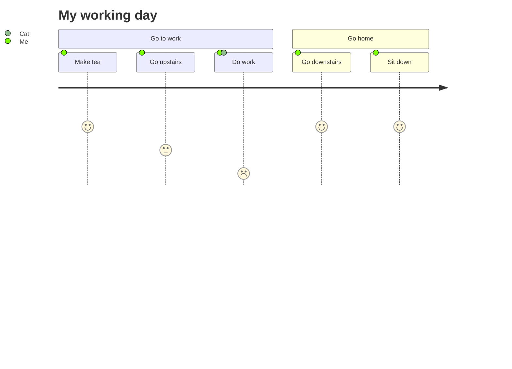

↑フロントマターがここに書かれてる（レンダリングでは別扱い）

## 目次

## WikiLink

### 通常

#### 存在するリンク

[[スペース「 」「　」・記号込]]
[[ディレクトリ配下]]
[[ディレクトリ配下#HEADING2]]
[[ディレクトリ配下|ディレクトリ配下・エイリアス確認]]
[[../directory/directory2/ディレクトリ配下|ディレクトリ配下の直で深いリンク（↑とは別）]]
[[PNG.png]]
[[PDF.pdf]]
[[#WikiLink]]
[[COMMON#Lists]]
[[ORIGINAL]]→自己リンク
[[Draft]]

#### 存在しない

[[デッドリンク]]
[[img.png]]

### リンクタグ（キーワード）

単独  
#[[COMMON]]
連続  
#[[COMMON]]#[[デッドリンク]]
文章中#[[COMMON]]#[[デッドリンク]]です

### 埋め込みリンク

![[ORIGINAL]]→自己リンク
![[COMMON]]→循環自己リンク
![[COMMON#Span Elements]]→ヘッダーリンク

#### PNG

##### 100

![[PNG.png|100]]

##### 100の横並び

![[PNG.png|100]]![[PNG.png|100]]![[PNG.png|100]]文字列

##### 指定なし（150×150）

![[PNG.png]]

#### 200

![[PNG.png|200]]

##### 存在しない

![[img.png]]

##### 破損

![[TEXT.png]]

#### JPG

![[JPG.jpg]]

#### PDF

![[PDF.pdf]]

#### BMP

![[BMP.bmp]]

#### GIF

![[GIF.gif]]

#### MP4

![[MP4.mp4]]

## CALLOUT

> 通常のblockquote
> Callout指定なし

> [!NOTE]
> リンク:[[COMMON]]
> 埋込![[JPG.jpg]]

> [!NOTE]- 開閉
> コンテンツ
>
> - list

> [!タイトル埋め込み]

> [!abstract]
> Lorem ipsum dolor sit amet

> [!WARNING]
> WARNING 表示

> [!info]
> Lorem ipsum dolor sit amet

> [!todo]
> Lorem ipsum dolor sit amet

> [!TIP]
> Helpful advice for doing things better or more easily.

> [!IMPORTANT]
> Key information users need to know to achieve their goal.

> [!success]
> Lorem ipsum dolor sit amet

> [!CAUTION]
> Advises about risks or negative outcomes of certain actions.

> [!question]
> Lorem ipsum dolor sit amet

> [!WARNING]
> Urgent info that needs immediate user attention to avoid problems.

> [!failure]
> Lorem ipsum dolor sit amet

> [!danger]
> Lorem ipsum dolor sit amet

> [!bug]
> Lorem ipsum dolor sit amet

> [!example]
> Lorem ipsum dolor sit amet

> [!quote]
> Lorem ipsum dolor sit amet

## Tag

#tag
文章中の#tag1

## Code

### Typescript（デフォ）

```ts
type WikiLinkData = {};

interface WikiLink extends Literal {
	type: "wikiLink";
	embed?: boolean;
	data?: WikiLinkData;
	value: string;
}
```

### Reactを動的に実行

```react
() => {
	const [isClicked, setIsClicked] = useState(false);

	return (
		<div
			style={{
				color: isClicked ? "red" : "black",
				cursor: 'pointer',
			}}
			onClick={() => setIsClicked(true)}
		>
			Hello!!
		</div>
	);
};
```

### DataViewのようなもの

`reactView`を言語指定

```reactView
<TaskList />
```

### Mermaid



## 外部埋め込みリンク

### 単独行の場合は埋め込みに変換(前後に空行が必要)

https://www.youtube.com/watch?v=mORyYinMBdg

https://www.youtube.com/watch?v=mORyYinMBdg

[タイトル付き](https://www.youtube.com/watch?v=mORyYinMBdg)

### 要素の一部の場合は普通のリンク

- リストや
  - https://www.youtube.com/watch?v=mORyYinMBdg

文章内(https://www.youtube.com/watch?v=mORyYinMBdg)

連続
https://www.youtube.com/watch?v=mORyYinMBdg
https://www.youtube.com/watch?v=mORyYinMBdg

### 種類ごと

#### YouTube

↑で確認

#### Twitter(未対応)

https://x.com/XDevelopers

#### その他

https://zenn.dev/

https://nextjs.org/docs/app/building-your-application/optimizing/third-party-libraries
